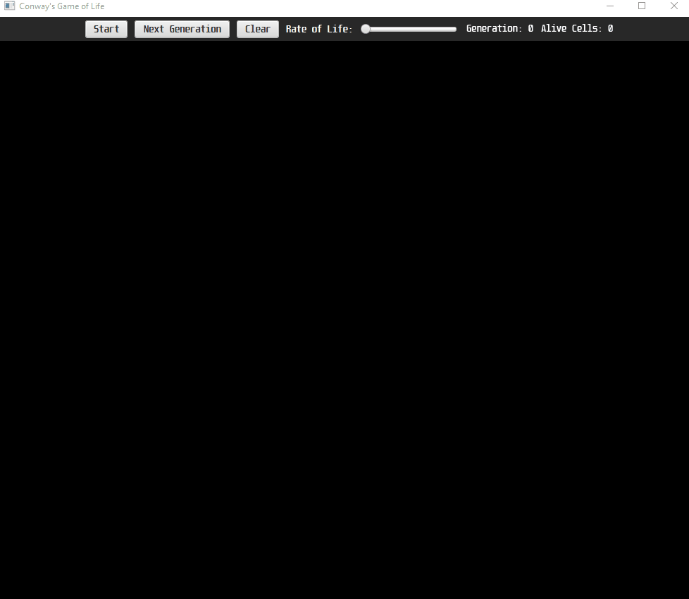
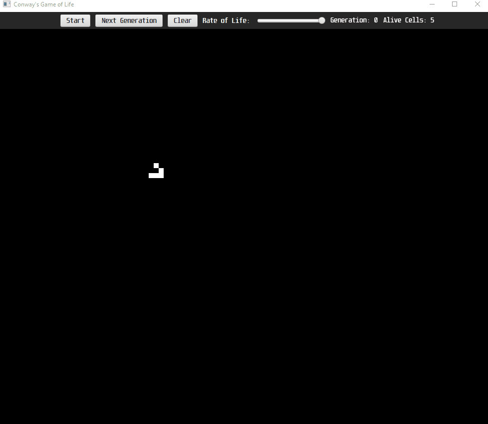

# Conway's Game of Life
A user interface to allow for visualization of Cellular Automata following Conway's Game of life.

## Draw on screen with mouse 
Click to add/remove a cell, or drag to keep drawing

## Start life or step through each generation, and adjust the speed of life!
You can also press space to go to the next generation. 

## You can even draw while life is generating due to multithreading!

